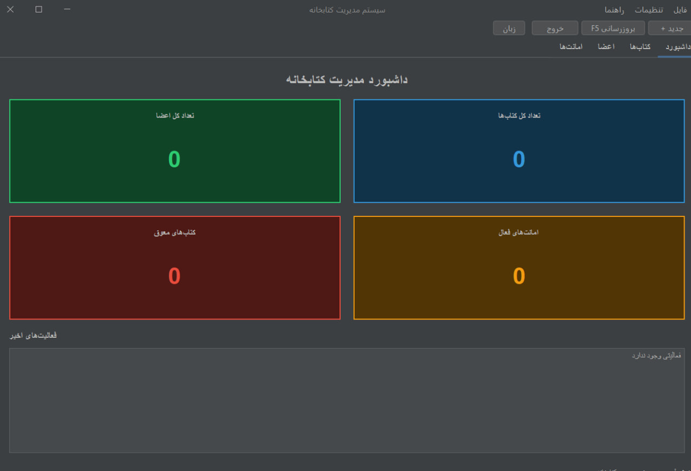

# سیستم مدیریت کتابخانه / Library Management System

سیستم مدیریت کتابخانه کامل ساخته شده با Java 17، Maven، JDBC، HikariCP و رابط کاربری گرافیکی Swing. این برنامه مدیریت کتاب‌ها، اعضا و عملیات امانت را با رابط کاربری حرفه‌ای انجام می‌دهد.

A complete Library Management System built with Java 17, Maven, JDBC, HikariCP, and a professional Swing GUI. This application manages books, members, and borrowing operations with an RTL Farsi interface and dark theme.

---

## فناوری‌های استفاده شده / Technologies Used

- **زبان / Language**: Java 17
- **ابزار ساخت / Build Tool**: Maven
- **پایگاه داده / Database**: H2 (embedded) / PostgreSQL (production)
- **اتصال اتصال / Connection Pool**: HikariCP
- **لاگ / Logging**: SLF4J with Logback
- **تست / Testing**: JUnit 5, Mockito
- **رابط کاربری / UI**: Java Swing + FlatDarkLaf (Dark Theme)
- **بین‌المللی‌سازی / i18n**: فارسی (RTL) + English

---
## تصاویر برنامه /Screenshot



## پیش‌نیازها / Prerequisites

- Java 17 or higher / جاوا ۱۷ یا بالاتر
- Maven 3.6+ / میون ۳.۶ یا بالاتر
- PostgreSQL (optional, for production) / پستگرس (اختیاری)

---

## ساختار پروژه / Project Structure

```
library-management-system/
├── src/
│   ├── main/
│   │   ├── java/com/library/
│   │   │   ├── entity/          # کلاس‌های موجودیت / Entity classes (Book, Member, BorrowRecord)
│   │   │   ├── repository/      # رابط‌ها و پیاده‌سازی JDBC / Repository interfaces and JDBC implementations
│   │   │   ├── service/         # منطق کسب‌وکار / Service interfaces and business logic
│   │   │   ├── exception/       # کلاس‌های خطای سفارشی / Custom exception classes
│   │   │   ├── ui/              # رابط کاربری Swing / Swing GUI (Dashboard, Books, Members, Borrows)
│   │   │   ├── i18n/            # بین‌المللی‌سازی / Internationalization (FA, EN)
│   │   │   ├── util/            # ابزار اتصال پایگاه داده / Database connection utility
│   │   │   └── Main.java        # نقطه ورود برنامه / Application entry point
│   │   └── resources/
│   │       ├── database.properties    # پیکربندی پایگاه داده / Database configuration
│   │       ├── logback.xml           # پیکربندی لاگ / Logging configuration
│   │       ├── i18n/                 # فایل‌های ترجمه / Translation files
│   │       └── db/
│   │           ├── h2/              # اسکریپت‌های H2
│   │           └── postgresql/      # اسکریپت‌های PostgreSQL
│   └── test/
│       └── java/com/library/service/  # تست‌های لایه سرویس / Service layer tests
└── pom.xml
```

---

## دستورالعمل‌های راه‌اندازی / Setup Instructions

### ۱. کلون مخزن / 1. Clone the repository
```bash
git clone https://github.com/danialchoopan/LibraryManagementSystemJAVA.git
cd LibraryManagementSystemJAVA
```

### ۲. پیکربندی پایگاه داده / 2. Configure database
فایل `src/main/resources/database.properties` را ویرایش کنید:
Edit `src/main/resources/database.properties`:
- H2 (پیش‌فرض / default): نیازی به تنظیم اضافی نیست / No additional setup needed
- PostgreSQL: URL JDBC، نام کاربری و رمز عبور را به‌روز کنید

### ۳. ساخت پروژه / 3. Build the project
```bash
mvn clean compile
```
یا / or:
```batch
.\mvnw.cmd compile
```

### ۴. اجرای برنامه / 4. Run the application

**رابط کاربری گرافیکی (پیش‌فرض) / GUI mode (default):**
```bash
java -cp "target/classes;C:\Users\<username>\.m2\repository\com\formdev\flatlaf\3.4\flatlaf-3.4.jar;C:\Users\<username>\.m2\repository\com\zaxxer\HikariCP\5.1.0\HikariCP-5.1.0.jar;C:\Users\<username>\.m2\repository\org\slf4j\slf4j-api\2.0.9\slf4j-api-2.0.9.jar;C:\Users\<username>\.m2\repository\ch\qos\logback\logback-classic\1.4.14\logback-classic-1.4.14.jar;C:\Users\<username>\.m2\repository\ch\qos\logback\logback-core\1.4.14\logback-core-1.4.14.jar" com.library.Main
```

یا فایل `run.bat` را اجرا کنید / Or just run `run.bat`

**حالت کنسول / Console mode:**
```bash
java -cp "target/classes;..." com.library.Main --console
```

---

## امکانات / Features

### مدیریت کتاب‌ها / Book Management
- افزودن، ویرایش و حذف کتاب / Add, update, delete books
- جستجو بر اساس عنوان، نویسنده یا شابک / Search by title, author, or ISBN
- جدول با مرتب‌سازی ستون‌ها و فیلتر زنده / Table with column sorting and live filtering
- نمایش رنگی موجودی (قرمز/زرد/سبز) / Color-coded availability display
- خروجی CSV / CSV export

### مدیریت اعضا / Member Management
- ثبت‌نام، ویرایش و حذف عضو / Register, update, delete members
- نمایش تعداد امانت‌های فعال هر عضو / Show active borrow count per member
- جستجو و فیلتر زنده / Search and live filtering
- خروجی CSV / CSV export

### مدیریت امانت‌ها / Borrowing System
- امانت گرفتن کتاب با اعتبارسنجی / Borrow books with validation
- برگرداندن کتاب با تشخیص تأخیر / Return books with overdue detection
- فیلتر: فعال، معوق، همه / Filter: Active, Overdue, All
- تاریخچه امانت عضو / Member borrow history
- نمایش وضعیت رنگی (امانت/برگردانده/معوق) / Color-coded status display
- خروجی CSV / CSV export

### داشبورد / Dashboard
- نمایش آمار کلی (کتاب‌ها، اعضا، امانت‌ها، معوق) / Stats cards (books, members, borrows, overdue)
- لیست فعالیت‌های اخیر / Recent activity list
- دکمه‌های دسترسی سریع / Quick action buttons

### رابط کاربری / UI Features
- تم تاریک (FlatDarkLaf) / Dark theme
- پشتیبانی RTL فارسی / RTL Farsi support
- تغییر زبان فارسی/انگلیسی از نوار ابزار / Language toggle from toolbar
- میانبرهای صفحه‌کلید: F5 (بروزرسانی) / Keyboard shortcuts: F5 (refresh)
- نوار ابزار با دکمه‌های سریع / Toolbar with quick action buttons
- دیالوگ درباره با اطلاعات نسخه / About dialog with version info

---

## قوانین کسب‌وکار / Business Rules

- حداکثر ۳ امانت فعال برای هر عضو / Maximum 3 active borrows per member
- حداکثر مدت امانت: ۱۴ روز / Maximum borrow period: 14 days
- هشدار تأخیر برای برگشت بعد از ۱۴ روز / Overdue warning after 14 days
- یکتایی شابک کتاب / ISBN uniqueness
- یکتایی کد ملی عضو / National code uniqueness

---

## ساختار پایگاه داده / Database Schema

### جدول کتاب‌ها / Books Table
| ستون / Column | نوع / Type | توضیح / Description |
|---|---|---|
| id | BIGINT | کلید اصلی / Primary Key |
| title | VARCHAR(255) | عنوان کتاب / Book Title |
| author | VARCHAR(255) | نویسنده / Author |
| isbn | VARCHAR(20) | شابک (یکتا) / ISBN (unique) |
| published_year | INTEGER | سال انتشار / Published Year |
| quantity | INTEGER | تعداد کل / Total Quantity |
| available_quantity | INTEGER | تعداد موجود / Available Quantity |

### جدول اعضا / Members Table
| ستون / Column | نوع / Type | توضیح / Description |
|---|---|---|
| id | BIGINT | کلید اصلی / Primary Key |
| name | VARCHAR(255) | نام / Name |
| national_code | VARCHAR(20) | کد ملی (یکتا) / National Code (unique) |
| phone_number | VARCHAR(20) | تلفن / Phone |
| join_date | DATE | تاریخ عضویت / Join Date |

### جدول امانت‌ها / Borrow Records Table
| ستون / Column | نوع / Type | توضیح / Description |
|---|---|---|
| id | BIGINT | کلید اصلی / Primary Key |
| book_id | BIGINT | کلید خارجی / Foreign Key → Books |
| member_id | BIGINT | کلید خارجی / Foreign Key → Members |
| borrow_date | DATE | تاریخ امانت / Borrow Date |
| return_date | DATE | تاریخ برگشت / Return Date |
| status | VARCHAR(20) | وضعیت: BORROWED, RETURNED, OVERDUE / Status |

---

## تست / Testing

```bash
mvn test
```

---

## عیب‌یابی / Troubleshooting

1. **مشکل اتصال پایگاه داده**: پیکربندی database.properties را بررسی کنید / Database connection issues: Verify database.properties
2. **تداخل پورت**: مطمئن شوید PostgreSQL در پورت تنظیم‌شده در حال اجراست / Port conflicts: Ensure PostgreSQL is running
3. **مشکل حافظه**: اندازه heap JVM را افزایش دهید: `-Xmx512m` / Memory issues: Increase JVM heap size

---

## بهبودهای آینده / Future Improvements

- رابط وب (REST API + فرانت‌اند) / Web-based UI
- احراز هویت کاربران / User authentication
- اعلان‌های ایمیلی برای کتاب‌های معوق / Email notifications for overdue
- سیستم رزرو کتاب / Book reservation
- محاسبه جریمه / Fine calculation
- یکپارچه‌سازی بارکد/QR / Barcode/QR integration
- گزارش‌گیری حسابرسی / Audit logging

---

## نویسنده / Author

ساخته شده با عشق به کدنویسی تمیز / Built with passion for clean code.

## مجوز / License

پروژه متن‌باز با مجوز MIT / Open source under MIT License.
